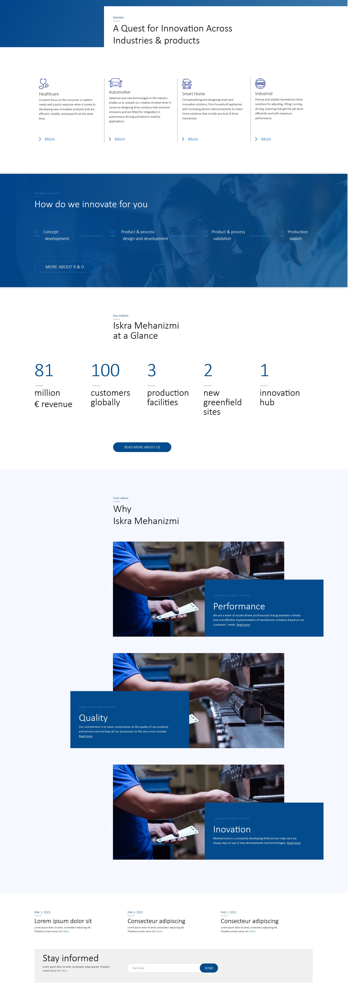

# HELLO 👋

This is the demo of selected sections of Iskra main web page [Figma design](https://www.figma.com/proto/FI7ZI9bO1ClhX2qC23rNJE/IskraMehanizmi?page-id=0%3A1&node-id=41%3A5&viewport=687%2C823%2C0.0205535851418972&scaling=min-zoom)

## How to use:

- App is deployed to Netlify [Live site url](https://boris-blagojevic-iskra-demo.netlify.app/)

OR 
- download repo and

`npm install` then

`npm start` go to http://localhost:1234/

## Build with:

HTML
SASS
litle JS

flex-wrap was a life saver for diferent screen sizes

## Screenshot

